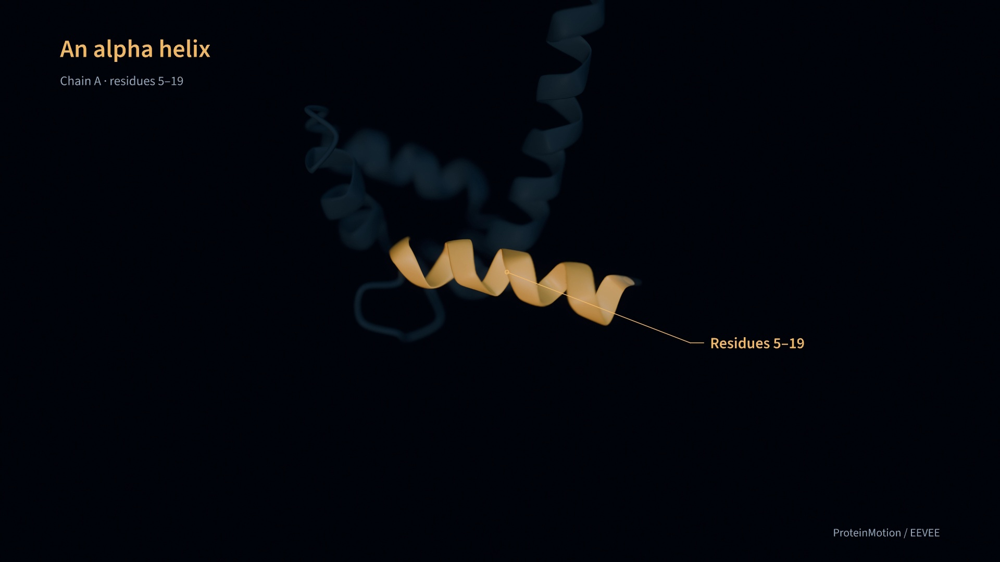

# ProteinMotion

ProteinMotion is a Python package for animating proteins, DNA, and RNA. Load a structure or trajectory, choose a molecular representation, add animations and labels, and export a video. The scene API follows Manim's `add`, `play`, and `wait` syntax.

[](https://github.com/pdpppd/proteinmotion/actions/workflows/checks.yml)
[](https://pdpppd.github.io/proteinmotion/)
[](https://www.python.org/)
[](LICENSE)

[Documentation](https://pdpppd.github.io/proteinmotion/) · [Video examples](https://pdpppd.github.io/proteinmotion/gallery/) · [Reference manual](https://pdpppd.github.io/proteinmotion/reference/) · [Releases](https://github.com/pdpppd/proteinmotion/releases)

[](https://pdpppd.github.io/proteinmotion/docs/calmodulin-in-focus/)

**Calmodulin in focus** is a 68-second EEVEE film at 1080p/60 fps. It shows helix close-ups, focus pulls, transparent surroundings, backbone atoms, and a surface colored by B factor. [Full script and output](https://pdpppd.github.io/proteinmotion/docs/calmodulin-in-focus/) · [Python source](examples/calmodulin_in_focus.py)

The [calmodulin and troponin C demo](https://pdpppd.github.io/proteinmotion/docs/showcase/) also covers NMR conformations, backbone morphing, distance measurements, and interaction highlights.

## Install

Use Python 3.11 or later and a GPU. Windows NVIDIA systems use Vulkan for rendering and NVENC for video encoding. macOS uses Metal and VideoToolbox; on Apple silicon, use an arm64 Python installation.

For the Windows support in this checkout, install from source in PowerShell:

```powershell
py -3.12 -m venv .venv
.\.venv\Scripts\python.exe -m pip install -e ".[dev,preview]"
.\.venv\Scripts\python.exe -m proteinmotion doctor --check-encoders
.\.venv\Scripts\python.exe -m proteinmotion render examples/quickstart.py Quickstart --fps 60 -o first-film.mp4
```

Install a current NVIDIA driver. CUDA Toolkit and a separate FFmpeg executable are not required. `doctor` should report your NVIDIA card under `selected_adapter` and a usable `h264_nvenc` encoder. See [Windows setup and GPU selection](docs/getting-started.md#windows-and-nvidia-gpus).

Install v0.10.0 from GitHub Releases:

```bash
python3 -m venv .venv
source .venv/bin/activate
python -m pip install \
  https://github.com/pdpppd/proteinmotion/releases/download/v0.10.0/proteinmotion-0.10.0-py3-none-any.whl
proteinmotion doctor
```

The package includes fonts, shaders, a sample structure, and a starter script. PyAV provides the FFmpeg libraries used for video export. See the [installation guide](https://pdpppd.github.io/proteinmotion/docs/getting-started/) for optional preview and MD trajectory readers.

DNA/RNA support is included in v0.10.0. The [DNA/RNA guide](https://pdpppd.github.io/proteinmotion/docs/dna-rna/) includes runnable examples and rendered output.

## Render a video

```bash
proteinmotion init my-movie
proteinmotion render my-movie/film.py ProteinMovie --fps 60 -o my-movie/film.mp4
```

`init` creates `film.py` and a ubiquitin structure in `my-movie/`. Edit the script to change the structure, selected residues, or animations.

A scene looks like this:

```python
from proteinmotion import Protein, ProteinScene, Rotate, Colorize, Write


class MyMovie(ProteinScene):
    def construct(self):
        protein = Protein.from_file("protein.cif").cartoon()
        self.add(protein)
        self.camera.frame(protein)

        helix = protein.select(chain="A", residues=(23, 34))
        self.play(Rotate(protein, angle=1.2), run_time=3)
        self.play(Colorize(helix, "#50e0d0"), run_time=1.5)
        self.play(Write(helix.callout("α helix")), run_time=2)
        self.focus(helix, run_time=1.5)
        self.wait(2)
```

Use a structure file and residue selection that match your protein. Residue ranges use inclusive PDB author numbers. Coordinates are in ångströms; angles are in radians. Animations in one `play()` call run together. Successive calls run in sequence.

## Render with Blender EEVEE

EEVEE adds depth of field with focus on a protein, residue, or selected region. Install [Blender 4.5 or later](https://www.blender.org/download/) separately. EEVEE is included in Blender. The default native renderer uses the Python dependencies installed above.

```bash
proteinmotion render my-movie/film.py ProteinMovie --renderer eevee --fps 60 -o film.mp4
```

ProteinMotion finds Blender on `PATH`, in standard Windows `Program Files/Blender Foundation/Blender <version>` folders, or at `/Applications/Blender.app` on macOS. For another location, pass `--blender /path/to/blender` or set `PROTEINMOTION_BLENDER`. On macOS, EEVEE uses Metal.

Set lens focus in your scene before the first animation:

```python
self.camera.set_focus(protein, chain="A", residues=5, fstop=5.6)
self.camera.set_focus(protein, chain="A", residues=(10, 20), atoms="CA", fstop=4)
```

The selected atoms define the focus point and follow the protein during motion. The camera position and zoom stay fixed. Use `FocusPull` to animate a change of lens focus. See the [EEVEE guide and rendered example](https://pdpppd.github.io/proteinmotion/docs/eevee/) for focus pulls, quality settings, and transparency behavior.

## Features

- **Representations:** cartoon, ribbon, ball-and-stick, and molecular surfaces.
- **DNA and RNA:** nucleotide backbones with base slabs, filled rings, sticks, or ladder rods. Colors, opacity, labels, surfaces, trajectories, and EEVEE focus work with nucleotide selections.
- **Animation:** rotation, translation, camera movement, deformation, and transitions between representations.
- **Residue styling:** color and opacity changes, applied together or delayed by residue.
- **Numerical properties:** B factors, aligned RMSF, and imported residue values mapped to color and cartoon thickness.
- **Plots:** distance traces, live contact maps, sequence strips, and color legends synchronized with the movie.
- **Density:** MRC/CCP4 maps, animated contours, and moving slices, with map coordinates preserved.
- **Labels:** text writing and erasing, amino acid and nucleotide names, and callout lines that connect labels to selected regions.
- **Rendering:** native GPU rendering or Blender EEVEE with depth of field.
- **Region tools:** camera focus and 3D sphere, box, or atom highlights.
- **Measurements:** distance labels, hydrogen-bond detection, and screened Coulomb estimates with imported charges.
- **States and trajectories:** multi-model PDB/mmCIF, NumPy arrays, and MDAnalysis readers for XTC, DCD, TRR, and other formats.
- **Structure morphs:** contact-map matching using protein Cα or DNA/RNA C1′ atoms, delayed motion along each chain, and fades for unmatched residues.

The [guides](https://pdpppd.github.io/proteinmotion/docs/scenes/) explain the options and provide code examples. ProteinMotion runs as a standalone renderer. Its exported videos can be used in Manim or a video editor.

## Use with an AI agent

The [ProteinMotion Movies skill](skills/proteinmotion-movies/SKILL.md) gives AI agents instructions and examples for writing scenes, rendering videos, and checking the results. Use it with an agent that can read local files and run Python commands.

Copy the skill to your agent's skills directory:

```bash
proteinmotion install-skill --path /path/to/skills/proteinmotion-movies
```

You can also [download the skill ZIP](https://github.com/pdpppd/proteinmotion/releases/download/v0.10.0/proteinmotion-movies-v0.10.0.zip) and extract it there. For agents that read instructions directly, point them to `SKILL.md` and keep the references and assets beside it.

Example request:

> Use the ProteinMotion Movies skill to make a 20-second video from my structure. Show a cartoon, label chain A residues 23–34, zoom into that region, then switch to ball-and-stick.

The [AI agent guide](https://pdpppd.github.io/proteinmotion/docs/agent-skill/) covers installation and example requests. Running `proteinmotion install-skill` with no path uses the Codex skills directory.

## Examples

These scripts and their input structures are in the repository:

| Example | Source |
|---|---|
| DNA morphs with C1′ matching and delayed nucleotide motion | [dna_morph.py](examples/dna_morph.py) |
| DNA base styles, strand transparency, and surfaces | [dna_styles.py](examples/dna_styles.py) |
| tRNA regions, modified bases, and B-factor surfaces | [rna_styles.py](examples/rna_styles.py) |
| B factors, residue colors, and cartoon thickness | [numerical_properties.py](examples/numerical_properties.py) |
| NMR playback with distance, contact, and sequence plots | [synchronized_plots.py](examples/synchronized_plots.py) |
| Electron-density contours and slices | [density_maps.py](examples/density_maps.py) |
| Calmodulin in focus: 68-second EEVEE film | [calmodulin_in_focus.py](examples/calmodulin_in_focus.py) |
| EEVEE depth of field and residue focus | [eevee_focus.py](examples/eevee_focus.py) |
| Calmodulin and troponin C feature demo | [feature_showcase.py](examples/feature_showcase.py) |
| Residue colors, surfaces, distances, and interactions | [molecular_tools.py](examples/molecular_tools.py) |
| Text, residue labels, and callouts | [labels_and_callouts.py](examples/labels_and_callouts.py) |
| Camera focus, 3D highlights, and NMR states | [nmr_regions.py](examples/nmr_regions.py) |
| Contact-guided backbone and ball-and-stick morphs | [backbone_morph.py](examples/backbone_morph.py) |
| Hydrogen bonds in an idealized alpha helix | [alpha_helix_hbonds.py](examples/alpha_helix_hbonds.py) |
| GroEL/GroES assembly | [large_protein.py](examples/large_protein.py) |

```bash
git clone https://github.com/pdpppd/proteinmotion.git
cd proteinmotion
python -m pip install -e '.[md,preview]'
proteinmotion render examples/nmr_regions.py RegionTour --fps 60 -o regions.mp4
```

## Rendering and scientific methods

Rendering and export are tested on Apple silicon Macs and Windows with an NVIDIA RTX 5070 Ti. On the RTX, a 600-frame 1080p/60 fps Quickstart export took a median 1.92 seconds with NVENC versus 4.07 seconds with CPU encoding across three runs. This includes rendering, GPU readback, and encoding; scene construction is excluded. See [benchmarks and test results](docs/VALIDATION.md) for settings, hardware, and limits.

Morphs and NMR playback interpolate coordinates for visualization. Use an MD trajectory when you need motion from a simulation. Hydrogen bonds use geometric criteria. Electrostatic estimates use a screened Coulomb model and depend on the supplied charges. The [rendering guide](https://pdpppd.github.io/proteinmotion/docs/rendering/) and [interaction guide](https://pdpppd.github.io/proteinmotion/docs/interactions/) describe the methods and their limits.

## Development

```bash
python -m pip install -e '.[dev,md,preview]'
ruff check src tests examples scripts skills
pytest
python -m build
```

Documentation is in `docs/`; the website is in `website/`. See [CONTRIBUTING.md](CONTRIBUTING.md) for setup and checks, and the [writing guide](docs/writing-guide.md) for documentation style.

## License

The package and website use the [MIT license](LICENSE). `Write` timing is adapted from MIT-licensed Manim. The bundled Source Sans 3 fonts use the SIL Open Font License. See [third-party notices](THIRD_PARTY.md) and [structure sources](https://pdpppd.github.io/proteinmotion/docs/rendering/#structure-provenance).
