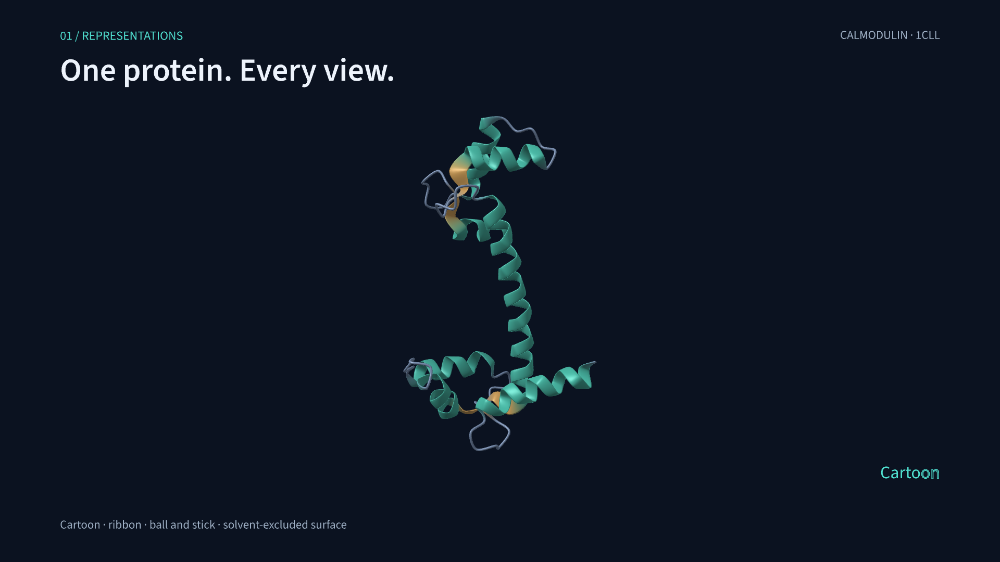

# ProteinMotion

ProteinMotion is a Python package for protein animation. Load a structure or trajectory, choose a molecular representation, add animations and labels, and export a video. The scene API follows Manim's `add`, `play`, and `wait` syntax.

[](https://github.com/pdpppd/proteinmotion/actions/workflows/checks.yml)
[](https://pdpppd.github.io/proteinmotion/)
[](https://www.python.org/)
[](LICENSE)

[Documentation](https://pdpppd.github.io/proteinmotion/) · [Video examples](https://pdpppd.github.io/proteinmotion/gallery/) · [API reference](https://pdpppd.github.io/proteinmotion/docs/api/) · [Releases](https://github.com/pdpppd/proteinmotion/releases)

[](https://pdpppd.github.io/proteinmotion/gallery/#showcase)

The demo shows calmodulin as a cartoon, ball-and-stick model, and surface. It includes residue colors, labels, camera movement, and NMR conformations. A backbone morph connects calmodulin to troponin C, followed by distance measurements and interaction highlights. [Demo script](examples/feature_showcase.py) · [Chapter list](https://pdpppd.github.io/proteinmotion/docs/showcase/)

## Install

Use Python 3.11 or later and a GPU. On Macs with Apple silicon, use an arm64 Python installation. ProteinMotion uses Metal for rendering and VideoToolbox for video encoding on macOS.

Install v0.7.0 from GitHub Releases:

```bash
python3 -m venv .venv
source .venv/bin/activate
python -m pip install \
  https://github.com/pdpppd/proteinmotion/releases/download/v0.7.0/proteinmotion-0.7.0-py3-none-any.whl
proteinmotion doctor
```

The package includes fonts, shaders, a sample structure, and a starter script. PyAV provides the FFmpeg libraries used for video export. See the [installation guide](https://pdpppd.github.io/proteinmotion/docs/getting-started/) for optional preview and MD trajectory readers.

## Render a video

```bash
proteinmotion init my-movie
proteinmotion render my-movie/film.py ProteinMovie --fps 60 -o my-movie/film.mp4
```

`init` creates `film.py` and a ubiquitin structure in `my-movie/`. Edit the script to change the structure, selected residues, or animations.

A scene looks like this:

```python
from proteinmotion import Protein, ProteinScene, Rotate, Colorize, Write


class MyMovie(ProteinScene):
    def construct(self):
        protein = Protein.from_file("protein.cif").cartoon()
        self.add(protein)
        self.camera.frame(protein)

        helix = protein.select(chain="A", residues=(23, 34))
        self.play(Rotate(protein, angle=1.2), run_time=3)
        self.play(Colorize(helix, "#50e0d0"), run_time=1.5)
        self.play(Write(helix.callout("α helix")), run_time=2)
        self.focus(helix, run_time=1.5)
        self.wait(2)
```

Use a structure file and residue selection that match your protein. Residue ranges use inclusive PDB author numbers. Coordinates are in ångströms; angles are in radians. Animations in one `play()` call run together. Successive calls run in sequence.

## Features

- **Representations:** cartoon, ribbon, ball-and-stick, and molecular surfaces.
- **Animation:** rotation, translation, camera movement, deformation, and transitions between representations.
- **Residue styling:** color and opacity changes, applied together or delayed by residue.
- **Labels:** text writing and erasing, amino acid names, and callout lines that connect labels to selected regions.
- **Region tools:** camera focus and 3D sphere, box, or atom highlights.
- **Measurements:** distance labels, hydrogen-bond detection, and screened Coulomb estimates with imported charges.
- **States and trajectories:** multi-model PDB/mmCIF, NumPy arrays, and MDAnalysis readers for XTC, DCD, TRR, and other formats.
- **Protein morphs:** contact-map matching, delayed backbone motion from N to C, and fades for unmatched residues.

The [guides](https://pdpppd.github.io/proteinmotion/docs/scenes/) explain the options and provide code examples. ProteinMotion runs as a standalone renderer. Its exported videos can be used in Manim or a video editor.

## Use with an AI agent

The [ProteinMotion Movies skill](skills/proteinmotion-movies/SKILL.md) gives AI agents instructions and examples for writing scenes, rendering videos, and checking the results. Use it with an agent that can read local files and run Python commands.

Copy the skill to your agent's skills directory:

```bash
proteinmotion install-skill --path /path/to/skills/proteinmotion-movies
```

You can also [download the skill ZIP](https://github.com/pdpppd/proteinmotion/releases/download/v0.7.0/proteinmotion-movies-v0.7.0.zip) and extract it there. For agents that read instructions directly, point them to `SKILL.md` and keep the references and assets beside it.

Example request:

> Use the ProteinMotion Movies skill to make a 20-second video from my structure. Show a cartoon, label chain A residues 23–34, zoom into that region, then switch to ball-and-stick.

The [AI agent guide](https://pdpppd.github.io/proteinmotion/docs/agent-skill/) covers installation and example requests. Running `proteinmotion install-skill` with no path uses the Codex skills directory.

## Examples

These scripts and their input structures are in the repository:

| Example | Source |
|---|---|
| Calmodulin and troponin C feature demo | [feature_showcase.py](examples/feature_showcase.py) |
| Residue colors, surfaces, distances, and interactions | [molecular_tools.py](examples/molecular_tools.py) |
| Text, residue labels, and callouts | [labels_and_callouts.py](examples/labels_and_callouts.py) |
| Camera focus, 3D highlights, and NMR states | [nmr_regions.py](examples/nmr_regions.py) |
| Contact-guided backbone and ball-and-stick morphs | [backbone_morph.py](examples/backbone_morph.py) |
| Hydrogen bonds in an idealized alpha helix | [alpha_helix_hbonds.py](examples/alpha_helix_hbonds.py) |
| GroEL/GroES assembly | [large_protein.py](examples/large_protein.py) |

```bash
git clone https://github.com/pdpppd/proteinmotion.git
cd proteinmotion
python -m pip install -e '.[md,preview]'
proteinmotion render examples/nmr_regions.py RegionTour --fps 60 -o regions.mp4
```

## Rendering and scientific methods

Rendering and export are tested on Apple silicon Macs. In one M3 Max run, a 24-second NMR cartoon video at 1080p/60 fps exported in 3.69 seconds. This includes rendering, GPU readback, and encoding; loading and scene construction were timed separately. See [benchmarks and test results](https://pdpppd.github.io/proteinmotion/docs/validation/) for the hardware, inputs, and measurements.

Morphs and NMR playback interpolate coordinates for visualization. Use an MD trajectory when you need motion from a simulation. Hydrogen bonds use geometric criteria. Electrostatic estimates use a screened Coulomb model and depend on the supplied charges. The [rendering guide](https://pdpppd.github.io/proteinmotion/docs/rendering/) and [interaction guide](https://pdpppd.github.io/proteinmotion/docs/interactions/) describe the methods and their limits.

## Development

```bash
python -m pip install -e '.[dev,md,preview]'
ruff check src tests examples scripts skills
pytest
python -m build
```

Documentation is in `docs/`; the website is in `website/`. See [CONTRIBUTING.md](CONTRIBUTING.md) for setup and checks, and the [writing guide](docs/writing-guide.md) for documentation style.

## License

The package and website use the [MIT license](LICENSE). `Write` timing is adapted from MIT-licensed Manim. The bundled Source Sans 3 fonts use the SIL Open Font License. See [third-party notices](THIRD_PARTY.md) and [structure sources](https://pdpppd.github.io/proteinmotion/docs/rendering/#structure-provenance).
