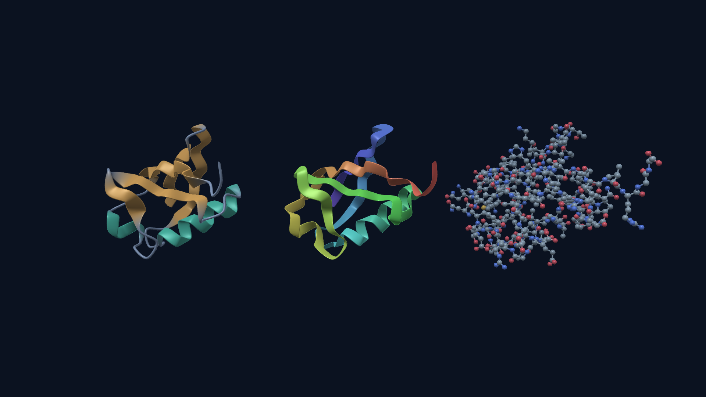
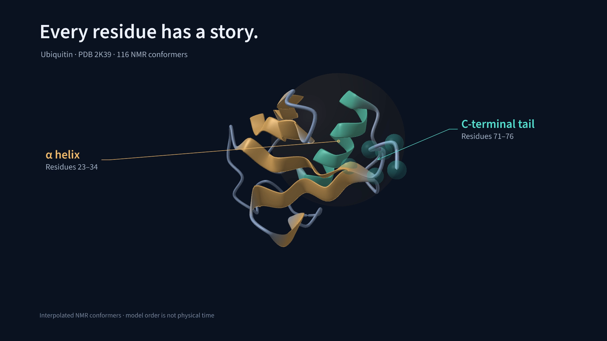
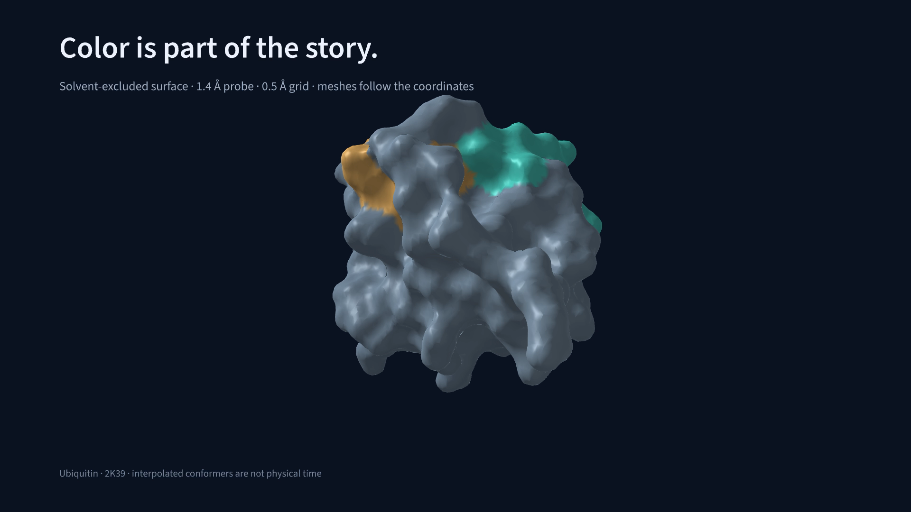

# ProteinMotion

**Protein animation, written in Python.**

A small, Manim-inspired API for molecular films, with native Metal rendering on Apple silicon. Compose cartoons, ribbons, ball-and-stick models, molecular surfaces, contact-guided morphs, real structural ensembles and animated residue labels in a Python scene.

[](https://github.com/pdpppd/proteinmotion/actions/workflows/checks.yml)
[](https://pdpppd.github.io/proteinmotion/)
[](https://www.python.org/)
[](LICENSE)

[**Documentation**](https://pdpppd.github.io/proteinmotion/) · [**Video gallery**](https://pdpppd.github.io/proteinmotion/gallery/) · [**API reference**](https://pdpppd.github.io/proteinmotion/docs/api/) · [**Molecular tools script**](examples/molecular_tools.py) · [**Labeling script**](examples/labels_and_callouts.py) · [**Complete NMR script**](examples/nmr_regions.py)

[](https://pdpppd.github.io/proteinmotion/gallery/)

## What you can make

- **Molecular representations:** cartoons, ribbons, ball-and-stick and vdW/SAS/approximate SES surfaces, with depth cueing and smooth transparency.
- **Residue styling:** colors and opacity across every representation, eased color fades, and configurable N-to-C staggering.
- **Measured interactions:** live 2D/3D distance rulers, geometric hydrogen bonds, and screened Coulomb contacts with imported charges.
- **Authored motion:** eased rotation, translation, camera movement, deformation, and morphing with deterministic forward/backward seeking.
- **Different-protein morphs:** contact-map matching with configurable error bounds, staggered N-to-C movement, and fades for unmatched residues.
- **Focused explanations:** live residue selections, camera tracking, and 3D sphere, box, or atom-halo highlights.
- **Written annotations:** Manim-style outline-to-fill `Write`, vector text, automatic amino acid names, and callout leaders attached to moving regions.
- **Ensemble films:** multi-model PDB/mmCIF, memory-mapped NumPy trajectories, and lazy MDAnalysis readers for XTC, DCD, TRR, and more.
- **Fast export on Apple silicon:** native wgpu → Metal, GPU coordinate interpolation, 4× MSAA, GPU NV12 conversion, and VideoToolbox encoding.

ProteinMotion is a standalone package with Manim-inspired syntax. Export its clips for use in Manim or another editor; it is not a Manim Mobject plug-in.

## Install

Python 3.11+ and a native GPU are required. Apple silicon/macOS is the verified platform.

```bash
git clone https://github.com/pdpppd/proteinmotion.git
cd proteinmotion
python3 -m venv .venv
source .venv/bin/activate
python -m pip install -e '.[preview]'
proteinmotion doctor
```

Install `'.[preview,md]'` to add MD trajectory readers. The core install is `pip install -e .`. PyAV wheels bundle FFmpeg libraries; rendering needs no FFmpeg executable, browser, Blender, or Xcode build. This version is installed from source; no PyPI release is assumed.

## Your first film

Save this as `film.py` in the repository root:

```python
from proteinmotion import (
    FadeIn, FadeOut, Protein, ProteinScene, Representation, Rotate,
)


class MyFilm(ProteinScene):
    def construct(self):
        protein = Protein.from_file("examples/data/1ubq.cif").cartoon().center()
        self.add(protein)
        self.camera.frame(protein, aspect=self.width / self.height)

        self.play(FadeIn(protein), run_time=0.8)
        self.play(Rotate(protein, 1.2), run_time=2)

        helix = protein.select(chain="A", residues=(23, 34))
        highlight = helix.highlight(style="box", color="#f2ba67")
        self.play(FadeIn(highlight), run_time=0.6)
        self.focus(helix, margin=1.7, run_time=1.5)
        self.play(Rotate(protein, 0.5), run_time=1.5)
        self.play(FadeOut(highlight), run_time=0.6)
        self.focus(protein, run_time=1.2)

        self.play(Representation(protein, "ball_and_stick"), run_time=1)
        self.wait(0.8)


if __name__ == "__main__":
    MyFilm(width=1920, height=1080, fps=60).render("film.mp4")
```

```bash
python film.py
# Or render the included equivalent:
proteinmotion render examples/quickstart.py Quickstart -o film.mp4 --fps 60
# Interactive preview (requires the preview extra):
proteinmotion preview examples/quickstart.py Quickstart
```

Residue ranges are inclusive PDB author numbers; angles are radians and coordinates are ångströms. Animations inside one `play()` run together. Successive calls run in sequence.

## Write labels into the scene

```python
from proteinmotion import Text, Write

title = Text("A protein in motion", font_size=60, font="semibold")
helix = protein.select(chain="A", residues=(23, 34), atoms="CA")
note = helix.callout("α helix", subtitle="Residues 23–34",
                    position=(0.73, 0.25), color="#f2ba67")
labels = protein.label_residues(chain="A", residues=[8, 44, 70])
self.play(Write(title), Write(note), run_time=2)
self.play(Write(labels, lag_ratio=0.08), run_time=2)
```

The text stays screen-facing while the leaders follow live 3D anchors. Glyph outlines are cached vectors rendered through Metal. `Write` traces contours before filling them; `Unwrite` reverses it. Bundled fonts cover Greek letters and common scientific labels. [Text and labeling guide](https://pdpppd.github.io/proteinmotion/docs/text/) · [Full runnable script](examples/labels_and_callouts.py).

[](https://pdpppd.github.io/proteinmotion/gallery/#labels)

## Color, surface and measure

```python
from proteinmotion import Colorize, SetOpacity, Distance, Electrostatics

helix = protein.select(chain="A", residues=(23, 34))
self.play(Colorize(helix, "#50e0d0", residue_delay=0.06), run_time=2)
self.play(SetOpacity(helix, 0.3), run_time=1)
self.play(Representation(protein, "surface"), run_time=1.2)

ruler = Distance(protein.select(residues=23), protein.select(residues=34),
                 mode="2d", style="dashed", prefix="Cα · ")
self.play(Write(ruler), run_time=1.5)

hb = protein.hydrogen_bonds(max_distance=3.5, min_angle=150)
self.play(Write(hb.highlight(mode="3d", show_distances=True)), run_time=1.5)
# For prepared charges matching the loaded atom identities:
# field = Electrostatics.from_pqr(protein, "prepared.pqr", dielectric=80)
# self.add(field.highlight(mode="2d", show_distances=True))
```

These snippets run inside a scene after loading `protein`. Surface meshes rebuild when coordinates change; rotations, styling and fades reuse the mesh. Hydrogen-bond detection can use explicit H or clearly flagged virtual backbone H. [Colors and surfaces](https://pdpppd.github.io/proteinmotion/docs/styling/) · [Distances and interactions](https://pdpppd.github.io/proteinmotion/docs/interactions/) · [Full runnable script](examples/molecular_tools.py).

[](https://pdpppd.github.io/proteinmotion/gallery/#surfaces)

## Explore the examples

| Example | What it demonstrates | Source |
|---|---|---|
| Alpha-helix H bonds | Explicit amide H, full i→i+4 network, separate H···O and N···O measurements | [alpha_helix_hbonds.py](examples/alpha_helix_hbonds.py) |
| Colors and surfaces | Staggered residue colors, local transparency, rebuilt NMR surfaces | [molecular_tools.py](examples/molecular_tools.py) |
| Distances and interactions | 3D/2D rulers, virtual backbone H bonds, screened Coulomb contacts | [molecular_tools.py](examples/molecular_tools.py) |
| Labels and callouts | Vector writing, amino acid names, live leaders in cartoon and ball-and-stick | [labels_and_callouts.py](examples/labels_and_callouts.py) |
| Writing study | Close-up outline-to-fill writing and erasing | [labels_and_callouts.py](examples/labels_and_callouts.py) |
| Region tour | Focus, moving 3D highlights, NMR playback | [nmr_regions.py](examples/nmr_regions.py) |
| 116-model ubiquitin ensemble | Cartoon and ball-and-stick state interpolation | [nmr_regions.py](examples/nmr_regions.py) |
| Calmodulin → troponin C | Contact-guided backbone morphing and unmatched fades | [backbone_morph.py](examples/backbone_morph.py) |
| GroEL/GroES | A 21-chain assembly with 58,870 selected heavy atoms | [large_protein.py](examples/large_protein.py) |
| Representation showcase | Cartoon, ribbon, atoms, morphs, and synthetic motion | [showcase.py](examples/showcase.py) |

```bash
proteinmotion render examples/molecular_tools.py StylingAndSurface -o surface.mp4 --fps 60
proteinmotion render examples/molecular_tools.py InteractionsAndDistances -o interactions.mp4 --fps 60
proteinmotion render examples/labels_and_callouts.py ProteinLabels -o labels.mp4 --fps 60
proteinmotion render examples/nmr_regions.py RegionTour -o regions.mp4 --fps 60
proteinmotion render examples/nmr_regions.py NMRAtoms -o ensemble.mp4 --fps 60
proteinmotion render examples/backbone_morph.py BallAndStickDemo -o morph.mp4 --fps 60
proteinmotion render examples/large_protein.py GroELComplex -o groel.mp4 --fps 60
```

Watch these in the [video gallery](https://pdpppd.github.io/proteinmotion/gallery/). The included NMR ensemble is [PDB 2K39](https://www.rcsb.org/structure/2K39); the example aligns the core Cα atoms before playback.

## Performance and verification

On the tested **Apple M3 Max**, the 24-second NMR cartoon exported at 1080p/60 fps in **3.69 seconds**. The annotated region tour exported in 4.52 seconds. These are single local runs including rendering/readback/encoding and excluding loading and scene construction, with potentially warm driver caches—not universal performance guarantees.

**97 local tests pass**, including native Metal rendering, residue styling, surfaces, numerical interactions, reproducible seeking, trajectory I/O, matching and hardware encoding. All 4,326 frames of the three NMR examples and all 1,728 frames of the new text examples decoded successfully. The two v0.6 films add 2,700 successfully decoded frames: the 24.8-second rebuilt-surface film exported in 33.69 seconds and the 20.2-second interaction film in 8.45 seconds at 1080p/60 fps. Surface rebuilding during coordinate motion is CPU-bound. [Methods, raw measurements, and limits](https://pdpppd.github.io/proteinmotion/docs/validation/).

## Scientific and implementation limits

Morphs and interpolated states are visual transitions, not energy-minimized pathways or MD simulations. NMR model order is not a physical time sequence. Contact matching is a bounded optimization; large-input results do not promise a global optimum. Ball-and-stick morphs translate whole matched residues and crossfade endpoint atom sets, without a side-chain atom correspondence.

Prepare whole, unwrapped MD coordinates before loading. Secondary-structure assignments remain fixed during playback. Transparency is approximate weighted blending; there are no shadows or SSAO. Solvent-excluded surfaces are voxel approximations, and rebuilding moving surfaces costs CPU time. Fast surface deformation is suitable only for small displacements. Text is a screen overlay; MathTex/LaTeX, markup and automatic font fallback are not implemented. Other GPUs/platforms have not been verified. [Full rendering notes](https://pdpppd.github.io/proteinmotion/docs/rendering/).

Hydrogen bonds use configurable geometry and limited chemical templates; inferred H is flagged. Screened Coulomb is an estimate, not a Poisson–Boltzmann solver or binding-energy calculation. Use prepared imported charges for your chemical state; the convenience formal-charge model is illustrative.

## Development

```bash
python -m pip install -e '.[dev,md]'
ruff check src tests examples
pytest
python -m build
```

The documentation lives in `docs/`; its static website lives in `website/`. Pushes to `main` build and deploy GitHub Pages automatically. See [CONTRIBUTING.md](CONTRIBUTING.md) for local docs preview, CI scope, and contribution guidance.

## License and provenance

[MIT](LICENSE) for the package and site code. `Write` timing is adapted from MIT-licensed Manim; bundled Source Sans 3 fonts use the SIL Open Font License. See [third-party notices](THIRD_PARTY.md). Dependencies retain their own licenses. Included PDB structures: [1UBQ](https://www.rcsb.org/structure/1UBQ), [1CLL](https://www.rcsb.org/structure/1CLL), [1NCX](https://www.rcsb.org/structure/1NCX), [1AON](https://www.rcsb.org/structure/1AON), and [2K39](https://www.rcsb.org/structure/2K39). See [provenance](https://pdpppd.github.io/proteinmotion/docs/rendering/#structure-provenance) and the [ensemble report](docs/nmr-ensemble-report.json).
