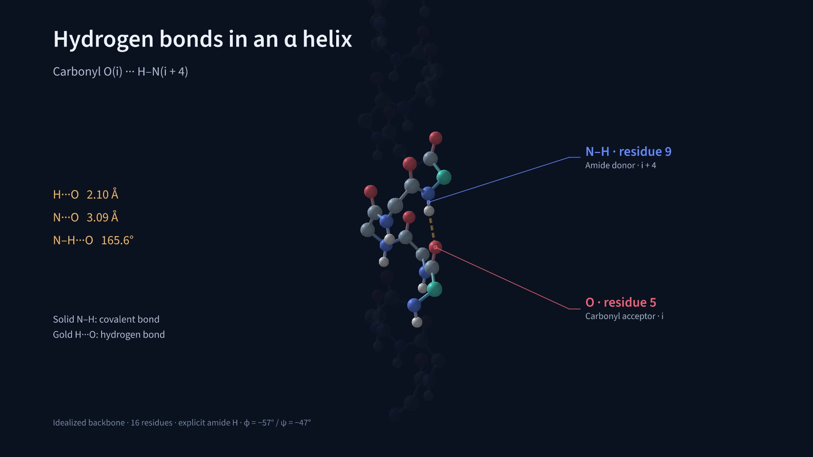

# Alpha-helix hydrogen-bond test

This example shows the alpha-helix hydrogen-bond pattern **O(i)···H–N(i+4)**. It uses an idealized 16-residue backbone with explicit amide hydrogens. Coordinates stay fixed as the camera rotates.

[Watch the film](https://pdpppd.github.io/proteinmotion/gallery/#alpha-helix) · [Download the complete script](alpha_helix_hbonds.py) · [Source on GitHub](https://github.com/pdpppd/proteinmotion/blob/main/examples/alpha_helix_hbonds.py)



## What the test establishes

The detector uses the coordinates and geometry criteria **N···O ≤ 3.5 Å** and **N–H···O ≥ 150°**. It finds the 12 expected pairs, O1–H5 through O12–H16, using geometry alone. The i→i+4 pattern is characteristic of an [alpha helix](https://www.ebi.ac.uk/training/online/courses/foundations-protein-structure/principles-of-protein-folding-and-architecture/secondary-structure-%CE%B1-helices-and-%CE%B2-sheets/%CE%B1-helix/).

The synthetic backbone uses φ = −57°, ψ = −47°, and trans peptide bonds with ω = 180°. It contains N, Cα, C, O, and amide H atoms. Side chains, other hydrogens, and terminal caps are omitted. This fixed geometry is used to test detection and display.

| Quantity | Value in this idealized fixture |
|---|---:|
| Expected / detected bonds | 12 / 12 |
| H···O distance | 2.10 Å |
| N···O distance | 3.09 Å |
| N–H···O angle | 165.6° |

Gold dashed lines show H···O contacts; solid sticks show covalent N–H bonds. The video first displays the full network, then zooms into O5···H–N9. Distance labels sit beside the close-up to keep the short bonds visible.

The zoom starts at 8.4 seconds and fades the surrounding residues. Covalent sticks end at the atom surfaces during the fade, keeping their internal sections hidden.

[All measured pairs as CSV](alpha-helix-hbonds.csv) · [Geometry and render report](alpha-helix-hbonds-report.json)

## Run it

From the repository root:

```bash output=gallery-alpha-helix
proteinmotion render examples/alpha_helix_hbonds.py AlphaHelixHBonds -o alpha-helix-hbonds.mp4 --fps 60
```

The core authoring code is:

```python
from proteinmotion import HydrogenBonds, Write

# p is the backbone with explicit H from the complete example.
hb = HydrogenBonds(p, hydrogens="explicit", max_distance=3.5, min_angle=150)
network = hb.highlight(
    mode="3d",
    endpoints="hydrogen_acceptor",
    show_distances=False,
    color="#f2ba67",
    radius=0.055,
    dash_count=5,
)
self.play(Write(network), run_time=2)
```

Load explicit H atoms with `Protein.from_file(path, include_hydrogens=True)`. Set `endpoints="hydrogen_acceptor"` to draw H···A lines. With `show_distances=True`, labels show that distance.

In `"backbone"` mode, or when `"auto"` infers a hydrogen, the line uses its calculated position. Inferred hydrogens provide line endpoints only; add explicit atoms to display them as spheres. `hb.hydrogen_position(pair)` returns the H coordinates in ångströms.

The default `endpoints="donor_acceptor"` draws D···A and labels donor–acceptor distance. `Interaction.distance` always remains D···A, whichever line endpoints you choose. Hydrogen endpoints apply only to hydrogen-bond analyses.

## Tests with synthetic and deposited coordinates

Tests check the backbone angles, expected residue pairs, explicit and inferred H endpoints, transformed positions, and repeatable rendering. Reversing one amide H removes its contact. An extended backbone with φ = −135° and ψ = 135° produces none of the helix contacts.

A separate test uses **1UBQ residues 23–34** with inferred backbone H. The default 150° cutoff detects six local helix bonds. Two more i→i+4 pairs have angles of about 149.8° and 145.4°; lowering the cutoff to 140° includes all eight. Contact counts therefore depend on the geometry threshold. See [hydrogen-bond methods](interactions.md).
